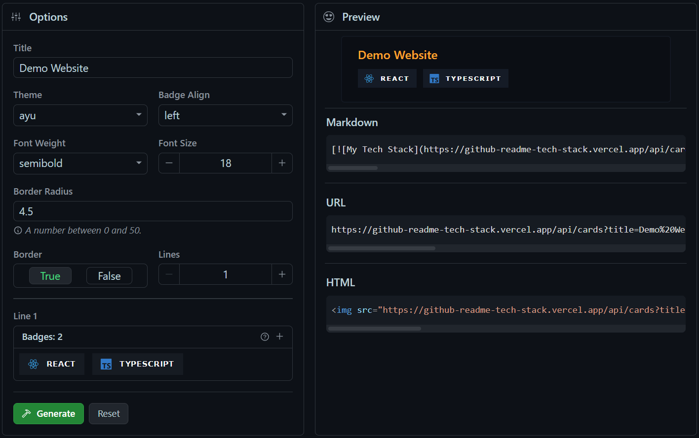

<div align="center">
  <h2>
    <a href="https://github-readme-tech-stack.vercel.app" target="_blank">🔖 GitHub Readme Tech Stack 🔖</a>
  </h2>
</div>

<div align="center">
  Display your favorite technologies, tools, or the tech stack your project uses with these fully customizable, good-looking cards on your GitHub README!  

  These cards are in perfect harmony with other similar README cards, such as <a href="https://github.com/anuraghazra/github-readme-stats" target="_blank">github-readme-stats</a> or <a href="https://github.com/DenverCoder1/github-readme-streak-stats" target="_blank">github-readme-streak-stats</a>. Nevertheless, these cards are fully customizable on our <a href="https://github-readme-tech-stack.vercel.app" target="_blank">website</a>.
</div>

<br>

<div align="center">
  <a href="https://github.com/0l1v3rr/github-readme-tech-stack/stargazers" target="_blank">
    
  </a>
  <a href="https://github.com/0l1v3rr/github-readme-tech-stack/graphs/contributors" target="_blank">
    
  </a>
  <a href="https://github.com/0l1v3rr/github-readme-tech-stack/releases" target="_blank">
    
  </a>
  <a href="https://twitter.com/intent/tweet?text=Display%20your%20favorite%20technologies%2C%20tools%2C%20or%20the%20tech%20stack%20your%20project%20uses%20with%20these%20fully%20customizable%2C%20good-looking%20cards%20on%20your%20GitHub%20README%21&url=https://github.com/0l1v3rr/github-readme-tech-stack&hashtagsgithub,readme,cards,stats,profile,shields,react,typescript,tailwindcss" target="_blank">
    
  </a>
</div>

<br>

<div align="center">
  <a href="https://github-readme-tech-stack.vercel.app/api/cards?theme=github_dark&lineCount=2&line1=node.js,node.js,0;typescript,typescript,0;express,express,61DAFB&line2=html5,html,0;react,react,0;tailwindcss,tailwind,0&title=This%20Project%27s%20Tech%20Stack">
    
  </a>
</div>

<hr>

## ⚡ Demo Website
With this site, you can customize your card with a live preview.  
[https://github-readme-tech-stack.vercel.app](https://github-readme-tech-stack.vercel.app)



> **Warning**  
> If the site doesn't load and displays a full white screen, try it in incognito mode, or clear your browser's cache.

<hr>

## 🔧 Query parameters
None of the fields are required. Every query parameter has a default value displayed below.

| Parameter | Example | Default value | Description|
|---------- |---------|---------------|------------|
| **title** | `?title=My%20Title` | My Tech Stack | The title of the card. %20 can be used as a space. |
| **theme** | `?theme=github_dark` | github | The theme of the card. You can browse between the themes [here](docs/THEMES.md). |
| **align** | `?align=center` | left | The alignment of the badges. (`left`, `center`, `right`) |
| **showBorder** | `?showBorder=false` | true | Display the border around the card or not. (`true`, `false`) |
| **borderRadius** | `?borderRadius=12.5` | 4.5 | Value between 0 and 50. |
| **fontSize** | `?fontSize=20` | 18 | The size of the title. Accepts a value between 15 and 30. |
| **fontWeight** | `?fontWeight=normal` | semibold | The thickness of the title. (`thin`, `normal`, `semibold`, `bold`) |
| **lineCount** | `?lineCount=2` | 1 | The number of lines you want to add to your card. |
| **line{n}** | `?line1=html5,html5,auto` | - | The current line of the badge, where {n} is a number. *`(1 <= n <= lineCount)`* |

<hr>

## 🪁 Themes
These cards come with several built-in themes you can use. You can find all of them by clicking [here](docs/THEMES.md).  
If you would like to use other themes, and add one for yourself and others, please check this [issue](https://github.com/0l1v3rr/github-readme-tech-stack/issues/2).

<hr>

## ❗ Important
- We suggest you not put too many badges inside one card, because the loading time can be too slow, and it can overflow the 15s limit, which results in a card that's not displayed. The maximum amount of badges inside one card should be around 16. If you want to display more, do it in two or three cards.
- If you use our [Demo Website](https://github-readme-tech-stack.vercel.app) to generate and customize your card, and it displays an empty screen, it's because your browser cached the previously deployed names of the JS bundles. In order to resolve this issue, clear your browser's cache or open the site in incognito mode.
- If you use a badge that has an invalid icon, it results in an inappropriate badge alignment. Please use badges that have valid icons. You can browse between the icons [here](https://simpleicons.org/).

<hr>

## 🧠 Tips

### 🪢 Align the card in the markdown
If you're using markdown, you may want to align your cards. There's an easy way to do it with the align attribute:
```html

```

### 📚 GitHub's media feature
You can use [GitHub's new feature](https://github.blog/changelog/2022-05-19-specify-theme-context-for-images-in-markdown-beta/) to specify whether to display images for light or dark mode users.

```html
<picture>
  <source 
    srcset="https://github-readme-tech-stack.vercel.app/api/cards?theme=github_dark&lineCount=1&line1=typescript,typescript,auto"
    media="(prefers-color-scheme: dark)"
  />
  <source
    srcset="https://github-readme-tech-stack.vercel.app/api/cards?theme=github&lineCount=1&line1=typescript,typescript,auto"
    media="(prefers-color-scheme: light), (prefers-color-scheme: no-preference)"
  />
  
</picture>
```

### 🎭 Adding custom SVG logo
We support this using [Base64](https://en.wikipedia.org/wiki/Base64) format.  
**[\*](https://stackoverflow.com/questions/38985050/how-do-i-use-the-logo-option-in-shields-io-badges) Here's an easy 3-step guide:**
1. Download the image and use one of the many online tools, e.g. [http://b64.io/](http://b64.io/), to encode it.
2. Encode the Base64 string in [percent-encoding](https://en.wikipedia.org/wiki/Percent-encoding). Take the Base64 string and use one of the many online tools, e.g. [http://meyerweb.com/eric/tools/dencoder/](http://meyerweb.com/eric/tools/dencoder/), to encode the string.
3. Finally, replace the first element of the badge (the `logoName`) with this string inside the URL. (e.g `<Base64>,typescript,2D79C7;`)

<hr>

## ⚒️ Building from source
If you don't have NodeJS, [download and install it](https://nodejs.org/en/).  
Then open a terminal and type these commands:

```sh
# Clone the project:
git clone https://github.com/0l1v3rr/github-readme-tech-stack.git
cd github-readme-tech-stack

# Install the dependencies:
npm i
npm run prepare

# Run the application:
npm run dev

# -- Frontend:
cd client

# Install the dependencies:
npm i

# Run the application:
npm start
```

<hr>

## 📝 License
This project is licensed under the [MIT License](LICENSE).

<hr>

## 🧑‍🤝‍🧑 Contributing
Every contribution is welcomed.  
You can find a contributing guideline [here](CONTRIBUTING.md).

<hr>

## 💡 Inspiration
- [github-readme-streak-stats](https://github.com/DenverCoder1/github-readme-streak-stats)
- [github-readme-stats](https://github.com/anuraghazra/github-readme-stats)
- [github-profile-summary-cards](https://github.com/vn7n24fzkq/github-profile-summary-cards)
- [markdown-badges](https://github.com/Ileriayo/markdown-badges)
- [shields.io](https://shields.io/)
