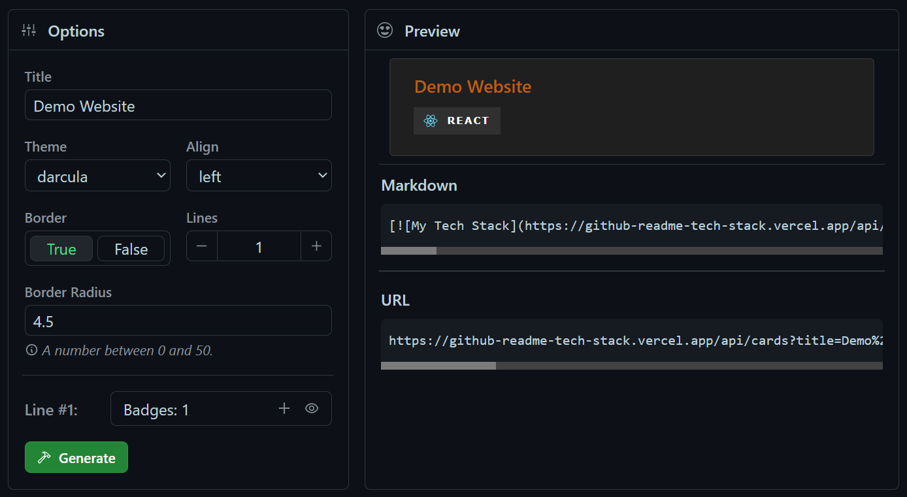

<div align="center">
  <h2><a href="https://github-readme-tech-stack.vercel.app">🪄 GitHub Readme Tech Stack 🪄</a></h2>
</div>

<div align="center">
  Dynamically generated, customizable technologies cards for your GitHub README.
</div>

<br>

<div align="center">
  
  
  
  
</div>

<br>

<div align="center">
  <a href="https://github-readme-tech-stack.vercel.app/api/cards?theme=github_dark&lineCount=2&line1=node.js,node.js,0;typescript,typescript,0;express,express,61DAFB&line2=html5,html,0;react,react,0;tailwindcss,tailwind,0&title=This%20Project%27s%20Tech%20Stack">
    
  </a>
</div>

<hr>

## 🖼️ Demo Website
With this site, you can customize your card.  
[https://github-readme-tech-stack.vercel.app](https://github-readme-tech-stack.vercel.app)



> **Warning**  
> If the site doesn't load and displays a full white screen, try it in incognito mode.

<hr>

- [🖼️ Demo Website](#️-demo-website)
- [🔧 Query parameters](#-query-parameters)
- [🪁 Themes](#-themes)
  - [📚 Adding a new theme](#-adding-a-new-theme)
- [🧠 Tips](#-tips)
  - [🪢 Align the card in the markdown](#-align-the-card-in-the-markdown)
  - [🎭 Adding custom SVG logo](#-adding-custom-svg-logo)
- [⚒️ Building from source](#️-building-from-source)
- [📝 License](#-license)
- [🧑‍🤝‍🧑 Contributing](#-contributing)
- [💡 Inspiration](#-inspiration)

<hr>

## 🔧 Query parameters
| Parameter | Example | Default value | Description|
|---------- |---------|---------------|------------|
| **title** | `?title=My%20Title` | My Tech Stack | The title of the card. %20 can be used as a space. |
| **theme** | `?theme=github_dark` | github | The theme of the card. You can browse between the themes [here](#-themes). |
| **align** | `?align=center` | left | The alignment of the badges. (`left`, `center`, `right`) |
| **showBorder** | `?showBorder=false` | true | Display the border around the card or not. (`true`, `false`) |
| **borderRadius** | `?borderRadius=12.5` | 4.5 | Value between 0 and 50. |
| **fontSize** | `?fontSize=20` | 18 | The size of the title. Accepts a value between 15 and 30. |
| **fontWeight** | `?fontWeight=normal` | semibold | The thickness of the title. (`thin`, `normal`, `semibold`, `bold`) |
| **lineCount** | `?lineCount=2` | 1 | The number of lines you want to add to your card. |
| **line{n}** | `?line1=html5,html5,auto` | - | The current line of the badge, where {n} is a number. *`(1 <= n <= lineCount)`* |

<hr>

## 🪁 Themes
Here are the themes spread in a table. The card title is the name of the theme.

<table>
  <tr>
    <td>
      
    </td>
    <td>
      
    </td>
  </tr>

  <tr>
    <td>
      
    </td>
    <td>
      
    </td>
  </tr>

  <tr>
    <td>
      
    </td>
    <td>
      
    </td>
  </tr>

  <tr>
    <td>
      
    </td>
    <td>
      
    </td>
  </tr>

  <tr>
    <td>
      
    </td>
    <td>
      
    </td>
  </tr>

  <tr>
    <td>
      
    </td>
    <td>
      
    </td>
  </tr>

  <tr>
    <td>
      
    </td>
    <td>
      
    </td>
  </tr>

  <tr>
    <td>
      
    </td>
    <td>
      
    </td>
  </tr>

  <tr>
    <td>
      
    </td>
    <td>
      
    </td>
  </tr>

  <tr>
    <td>
      
    </td>
    <td>
      
    </td>
  </tr>

  <tr>
    <td>
      
    </td>
    <td>
      
    </td>
  </tr>

  <tr>
    <td>
      
    </td>
    <td>
      
    </td>
  </tr>
</table>

### 📚 Adding a new theme
Would you like to add a new theme to the list? Check this [issue](https://github.com/0l1v3rr/github-readme-tech-stack/issues/2), please. **Thanks!**

<hr>

## 🧠 Tips

### 🪢 Align the card in the markdown
If you're using markdown, you may want to align your cards. There's an easy way to do it with the align attribute:
```html

```

### 🎭 Adding custom SVG logo
We support this using [Base64](https://en.wikipedia.org/wiki/Base64) format.  
**[\*](https://stackoverflow.com/questions/38985050/how-do-i-use-the-logo-option-in-shields-io-badges) Here's an easy 3-step guide:**
1. Download the image and use one of the many online tools, e.g. [http://b64.io/](http://b64.io/), to encode it.
2. Encode the Base64 string in [percent-encoding](https://en.wikipedia.org/wiki/Percent-encoding). Take the Base64 string and use one of the many online tools, e.g. [http://meyerweb.com/eric/tools/dencoder/](http://meyerweb.com/eric/tools/dencoder/), to encode the string.
3. Finally, replace the first element of the badge (the `logoName`) with this string inside the URL. (e.g `<Base64>,typescript,2D79C7;`)

> **Note**  
> Sometimes the encoded string, of either step 2 or 3, may be too long to be used. You should then try to reduce the size (total pixels) of the image and try again.

<hr>

## ⚒️ Building from source
If you don't have NodeJS, [download and install it](https://nodejs.org/en/).  
Then open a terminal and type these commands:

```sh
# Clone the project:
git clone https://github.com/0l1v3rr/github-readme-tech-stack.git
cd github-readme-tech-stack

# Install the dependencies:
npm i

# Install husky (optional, but recommended)
npm run prepare

# Run the application:
npm run dev

# -- Frontend:
cd client

# Install the dependencies:
npm i

# Run the application:
npm start
```

<hr>

## 📝 License
This project is licensed under the [MIT License](LICENSE).

<hr>

## 🧑‍🤝‍🧑 Contributing
Every contribution is welcomed.  
You can find a contributing guideline [here](CONTRIBUTING.md).

<hr>

## 💡 Inspiration
I was inspired by dozens of other projects, check 'em out as well!
- [github-readme-streak-stats](https://github.com/DenverCoder1/github-readme-streak-stats)
- [github-readme-stats](https://github.com/anuraghazra/github-readme-stats)
- [github-profile-summary-cards](https://github.com/vn7n24fzkq/github-profile-summary-cards)
- [markdown-badges](https://github.com/Ileriayo/markdown-badges)
- [shields.io](https://shields.io/)
