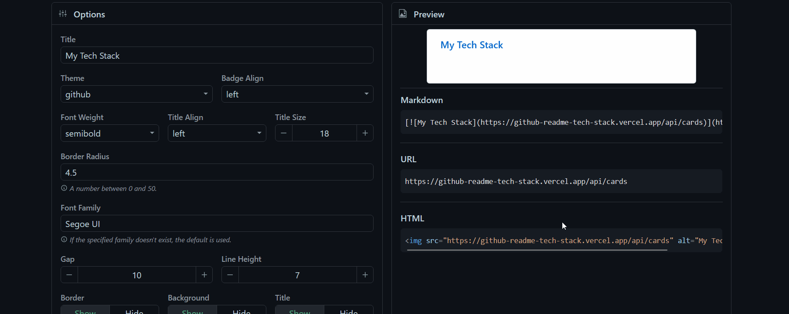

<div align="center">
  <h2>GitHub Readme Tech Stack</h2>
</div>

<div align="center">
  <a href="https://github.com/0l1v3rr/github-readme-tech-stack/issues/new?assignees=&labels=enhancement&template=feature_request.md&title=" target="_blank">
    
  </a>
  <a href="https://github.com/0l1v3rr/github-readme-tech-stack/issues/new?assignees=&labels=bug&template=bug_report.md&title=" target="_blank">
    
  </a>
  <a href="https://github-readme-tech-stack.vercel.app" target="_blank">
    
  </a>
  <a href="https://twitter.com/intent/tweet?text=Display%20your%20favorite%20technologies%2C%20tools%2C%20or%20the%20tech%20stack%20your%20project%20uses%20with%20these%20fully%20customizable%2C%20good-looking%20cards%20on%20your%20GitHub%20README%21&url=https://github.com/0l1v3rr/github-readme-tech-stack&hashtagsgithub,readme,cards,stats,profile,shields,react,typescript,tailwindcss" target="_blank">
    
  </a>
</div>

<div align="center">
  Show off your favorite technologies, tools, or the tech stack your project uses with these fully customizable, great-looking cards on your GitHub README!
</div>

<br>

<div align="center">
  <a href="https://github-readme-tech-stack.vercel.app/api/cards?theme=github_dark_red&lineCount=2&line1=node.js,node.js,0;typescript,typescript,0;express,express,61DAFB&line2=html5,html,0;react,react,0;tailwindcss,tailwind,0&title=This%20Project%27s%20Tech%20Stack">
    
  </a>
</div>

<hr>

## ⚡ Quick Start

The easiest way to get started is to visit our website, where you can customize and preview your card live.  
[https://github-readme-tech-stack.vercel.app](https://github-readme-tech-stack.vercel.app)

<p align="center">
    
</p>

<hr>

## 🔧 Query parameters

None of the fields are required. Each query parameter has a default value, which is listed below.

| Parameter        | Example                   | Default value | Description                                                                               |
| ---------------- | ------------------------- | ------------- | ----------------------------------------------------------------------------------------- |
| **title**        | `?title=My%20Title`       | My Tech Stack | The title of the card. `%20` can be used as a space.                                      |
| **theme**        | `?theme=github_dark`      | github        | The theme of the card. You can browse between the themes [here](docs/THEMES.md).          |
| **align**        | `?align=center`           | left          | The alignment of the badges. (`left`, `center`, `right`)                                  |
| **titleAlign**   | `?align=center`           | left          | The alignment of the title. (`left`, `center`, `right`)                                   |
| **showBorder**   | `?showBorder=false`       | true          | Display the border around the card or not. (`true`, `false`)                              |
| **hideTitle**    | `?hideTitle=true`         | false         | Display the title of the card or not. (`true`, `false`)                                   |
| **hideBg**       | `?hideBg=true`            | false         | If true, sets the background to transparent. (`true`, `false`)                            |
| **borderRadius** | `?borderRadius=12.5`      | 4.5           | Number between 0 and 50.                                                                  |
| **fontFamily**   | `?fontFamily=consolas`    | Segoe UI      | The font family of the title. If the specified family doesn't exist, the default is used. |
| **fontSize**     | `?fontSize=20`            | 18            | The size of the title. Accepts a number between 15 and 30.                                |
| **fontWeight**   | `?fontWeight=normal`      | semibold      | The thickness of the title. (`thin`, `normal`, `semibold`, `bold`)                        |
| **width**        | `?width=500`              | 495           | The width of the card. Accepts a valid number.                                            |
| **gap**          | `?gap=15`                 | 10            | The gap between the badges. Accepts a number between 0 and 30.                            |
| **lineHeight**   | `?lineHeight=10`          | 7             | The gap between the lines. Accepts a number between 0 and 30.                             |
| **lineCount**    | `?lineCount=2`            | 1             | The number of lines you want to add to your card.                                         |
| **line{n}**      | `?line1=html5,html5,auto` | -             | The current line of the badge, where {n} is a number. _`(1 <= n <= lineCount)`_           |

<hr>

## 🪁 Themes

These cards come with several built-in themes that you can use. You can find them all by clicking [here](docs/THEMES.md).  
If you have a cool new theme in mind, or want to add one for yourself and others, please see [#45](https://github.com/0l1v3rr/github-readme-tech-stack/issues/45).

### 🖌 Customizing a theme

These query parameters allow you to customize a theme.  
These parameters only accept valid hexadecimal colors, otherwise they will not be applied. Please use `%23` instead of `#`.

> **Warning**  
> If the `?theme=` parameter is specified, any of these color adjustments will override the theme values.

| Parameter      | Example                 | Description                  |
| -------------- | ----------------------- | ---------------------------- |
| **bg**         | `?bg=%2383324c`         | The color of the background. |
| **border**     | `?border=%232da7c7`     | The color of the border.     |
| **badge**      | `?badge=%2383324c`      | The color of the badges.     |
| **titleColor** | `?titleColor=%232da7c7` | The color of the title.      |

<hr>

## 🧠 Tips

### 🪢 Align the card in the markdown

If you're using markdown, you may want to align your cards. There's an easy way to do this with the align attribute:

```html

```

### 📚 GitHub's media feature

You can use [GitHub's new feature](https://github.blog/changelog/2022-05-19-specify-theme-context-for-images-in-markdown-beta/) to specify whether to display images for light or dark mode users.

```html
<picture>
  <source
    srcset="
      https://github-readme-tech-stack.vercel.app/api/cards?theme=github_dark&lineCount=1&line1=typescript,typescript,auto
    "
    media="(prefers-color-scheme: dark)"
  />
  <source
    srcset="
      https://github-readme-tech-stack.vercel.app/api/cards?theme=github&lineCount=1&line1=typescript,typescript,auto
    "
    media="(prefers-color-scheme: light), (prefers-color-scheme: no-preference)"
  />
  
</picture>
```

### 🎭 Adding custom SVG logo

We support this using [Base64](https://en.wikipedia.org/wiki/Base64) format.
**[\*](https://stackoverflow.com/questions/38985050/how-do-i-use-the-logo-option-in-shields-io-badges) Here's an easy 3-step guide:**

1. Download the SVG and use one of the many online tools, e.g. [http://b64.io/](http://b64.io/), to encode it.
2. Encode the Base64 string in [percent-encoding](https://en.wikipedia.org/wiki/Percent-encoding). Take the Base64 string and use one of the many online tools, e.g. [http://meyerweb.com/eric/tools/dencoder/](http://meyerweb.com/eric/tools/dencoder/), to encode the string.
3. Finally, replace the first element of a badge (the `logoName`) with this string inside the URL. (`<Base64>,typescript,2D79C7;`)

<hr>

## ⚒️ Building from source

If you don't have NodeJS, [download and install it](https://nodejs.org/en/).  
Then open a terminal and type the following commands:

**Backend:**

```sh
# Clone the project:
git clone https://github.com/0l1v3rr/github-readme-tech-stack.git
cd github-readme-tech-stack

# Install the dependencies:
npm i
npm run prepare

# Run the application:
npm run dev
```

**Frontend:**

```sh
cd client

# Install the dependencies:
npm i

# Run the application:
npm start
```

<hr>

## 🧑‍🤝‍🧑 Contributing

All contributions are welcome.  
You can find a contributing guideline [here](CONTRIBUTING.md).  
This project is released under the [MIT License](LICENSE).

<hr>

## 💡 Inspiration

- [github-readme-streak-stats](https://github.com/DenverCoder1/github-readme-streak-stats)
- [github-readme-stats](https://github.com/anuraghazra/github-readme-stats)
- [github-profile-summary-cards](https://github.com/vn7n24fzkq/github-profile-summary-cards)
- [markdown-badges](https://github.com/Ileriayo/markdown-badges)
- [shields.io](https://shields.io/)
- [simple-icons](https://simpleicons.org/)
